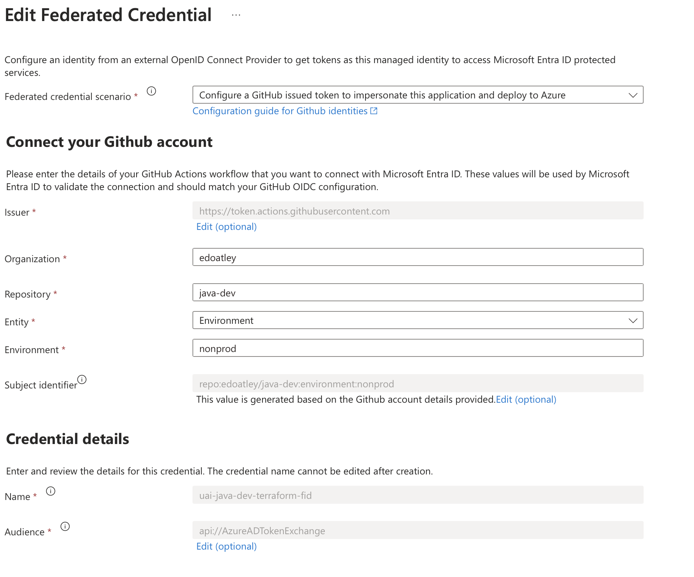

# Authentication

- [Authentication](#authentication)
  - [Introduction](#introduction)
  - [Authentication setup in Azure](#authentication-setup-in-azure)
  - [Authentication setup in GitHub](#authentication-setup-in-github)
  - [Write terraform action](#write-terraform-action)
  - [Conclusion](#conclusion)


## Introduction

In this short article I look at authenticating to Azure from terraform code running in GitHub Actions using User Assigned Identities (UAI). UAIs in Azure are a subtype of managed identities that have their own lifecycle independent of any resource they may be used with. [Managed identities](https://learn.microsoft.com/en-us/entra/identity/managed-identities-azure-resources/overview) are a special kind of service principal that are great as they:

- can be assigned fine grained permissions to suit exact purpose for which they are used
- don't need you to manage credentials for them.

UAI therefore provide some great benefits in improving security.

To set up authentication from GitHub actions to Azure we must follow three steps:

1. Create the necessary resources and configurations in Azure
2. Configure the GitHub repository to provide suitable [OpenID Connect (OIDC)](https://www.microsoft.com/en-us/security/business/security-101/what-is-openid-connect-oidc#heading-oc007a) tokens
3. Configure authentication in the terraform code

I will now walk you throuGitHub these steps, I hope you find it helpful.

## Authentication setup in Azure

In this stage we define everything we need in Azure for successful authentication:

1. Create a resource group:

```bash
az group create \
    --name "${RESOURCE_GROUP}" \
    --location "${LOCATION}"
```

2. Define our UAI:

```bash
az identity create \
    --name "${MANAGED_ID_NAME}" \
    --resource-group "${RESOURCE_GROUP}" \
    --location "${LOCATION}"
```

3. Define a storage account with a container for our terraform remote state :

```bash
az storage account create \
    --name "${STORAGE_ACCOUNT}" \
    --resource-group "${RESOURCE_GROUP}" \
    --location "${LOCATION}" \
    --sku Standard_LRS

az storage container create \
    --name "${SA_CONTAINER}" \
    --account-name "$STORAGE_ACCOUNT" \
    --account-key "$(az storage account keys list --resource-group "${RESOURCE_GROUP}" --account-name "${STORAGE_ACCOUNT}" --query "[0].value" -o tsv)"
```

4. Grant the UAI permissions:

```bash
az role assignment create \
    --role "Contributor" \
    --assignee "${PRINCIPAL_ID}" \
    --scope "/subscriptions/${SUBSCRIPTION_ID}"

STORAGE_ACCOUNT_ID=$(az storage account show --name "${STORAGE_ACCOUNT}" --resource-group "${RESOURCE_GROUP}" --query "id" --output tsv)
az role assignment create \
    --role "Storage Blob Data Contributor" \
    --assignee "${PRINCIPAL_ID}" \
    --scope "${STORAGE_ACCOUNT_ID}" 
```

5. Create a federated credential enabling the UAI to securely delegate it's permissions to GitHub by allowing it to assume the identity:

```bash
az identity federated-credential create \
    --name "${MANAGED_ID_NAME}-fid" \
    --identity-name "${MANAGED_ID_NAME}" \
    --resource-group "${RESOURCE_GROUP}" \
    --issuer 'https://token.actions.GitHubusercontent.com' \
    --subject 'repo:edoatley/java-dev:environment:nonprod' \
    --audiences 'api://AzureADTokenExchange'
```

Note that the `subject` argument scopes access to a specific repository `edoatley/java-dev` and a specific environment `nonprod`. This
is perhaps clearer in the portal representation of the federated credential: 

This completes our Azure set up.

## Authentication setup in GitHub

With this everything defined in Azure we can configure GitHub

1. in GitHub we create the Environment `nonprod` with a single environment secret `AZURE_TERRAFORM_CLIENT_ID`:


`AZURE_TERRAFORM_CLIENT_ID` is configured to match the user assigned identity client ID.

We can then set up the repository secrets `AZURE_TENANT_ID` and `AZURE_TENANT_ID`:


and these variables to point to the correct location in the terraform state remote storage:


You could consider moving some of these repository values to the environment rather than repository level, that would likely be a good idea 
but was not part of my experimentation.

## Write terraform action

With all the setup done we can now write an action to try it out. There are a few key things:

1. Ensure that you grant these permissions:

```yaml
permissions:
  id-token: write
  contents: read
```

This will allow generation of the token

2. Ensure you set `environment` to match the one configured in the federated credential and GitHub:

```yaml
jobs:
  deploy-infra:
    name: Provision Azure infrastructure
    runs-on: ubuntu-latest
    environment: nonprod
    ...
```

3. Configure the following environment variables for terraform to use so it knows how to authenticate:

```yaml
env:
    ARM_USE_OIDC: true # Should OIDC authentication be used? 
    ARM_USE_AZUREAD: true # Whether Azure Active Directory Authentication should be used to access the Blob Storage Account.
    ARM_TENANT_ID: ${{ secrets.AZURE_TENANT_ID }}
    ARM_SUBSCRIPTION_ID: ${{ secrets.AZURE_SUBSCRIPTION_ID }}
    ARM_CLIENT_ID: ${{ secrets.AZURE_TERRAFORM_CLIENT_ID }}
```

4. The action can then proceed as normal:

```bash
# The backend config values should match those we used when creating the storage account for the remote backend
# and defined in the GitHub repository
terraform init -input=false \
    -backend-config=resource_group_name=${{ vars.AZURE_TERRAFORM_STORAGE_ACC_RG }}  \
    -backend-config=storage_account_name=${{ vars.AZURE_TERRAFORM_STORAGE_ACC }}  \
    -backend-config=container_name=somecontainername \
    -backend-config=key=backend-for-tfproj.tfstate

# Build a terraform plan
terraform plan -input=false \
    -out=tfplan ${{inputs.tfParams}}

# Apply the plan and deploy the infrastructure
terraform apply tfplan
```

## Conclusion

Using User Assigned Identities to authenticate to Azure from GitHub actions is a robust method that provides a great way
to control access to your Azure resources and is relatively straightforward to set up. I will certainly be looking to 
leverage this approach going forward.