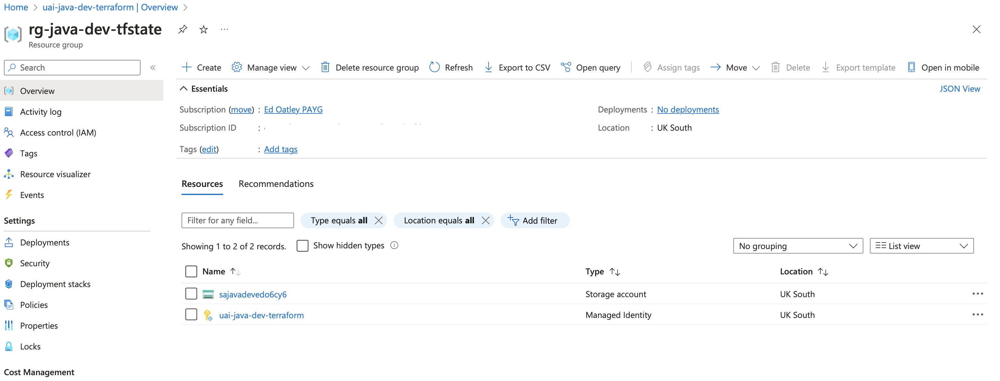
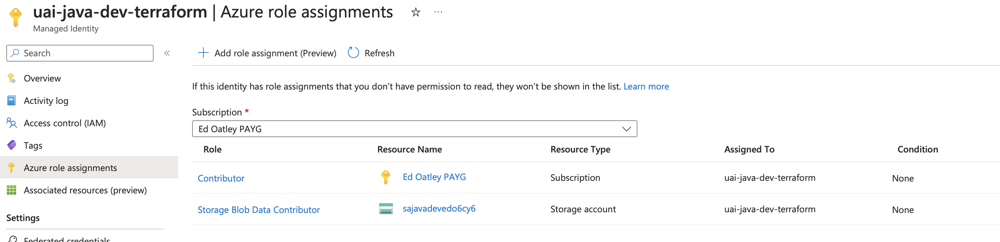
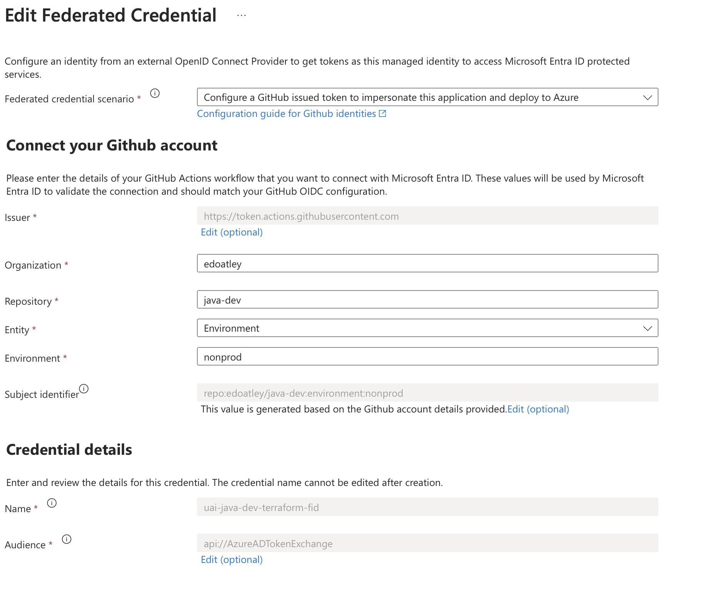
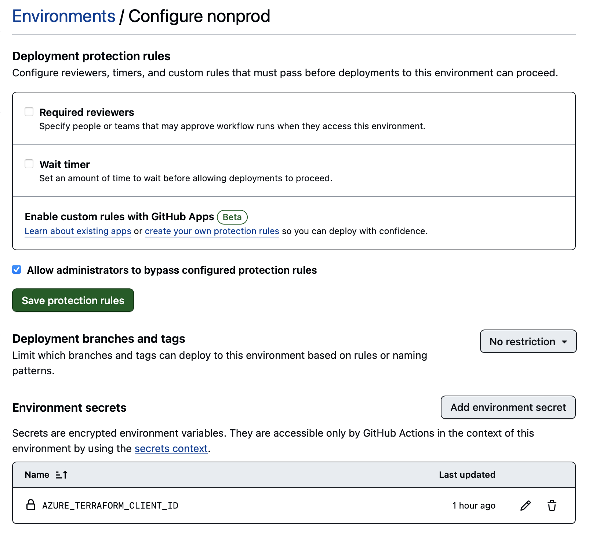
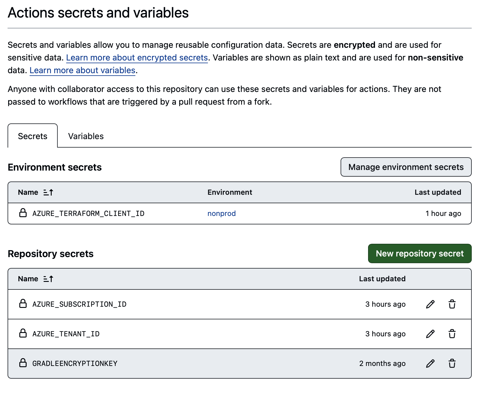
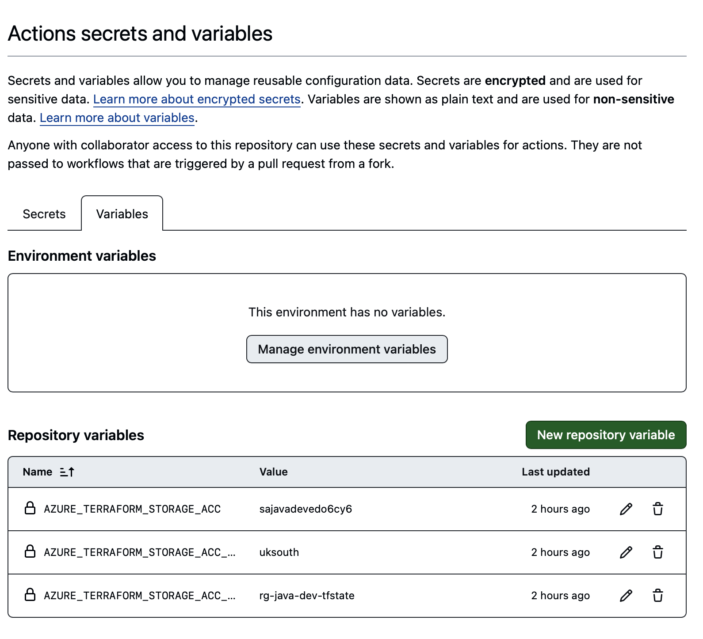

# java-dev

Investigating neat ways to do java cloud native dev

- [java-dev](#java-dev)
  - [Plan](#plan)
  - [Dev Container](#dev-container)
    - [Setup](#setup)
    - [Validation](#validation)
      - [Basic Validation](#basic-validation)
      - [Deeper validation: gradle](#deeper-validation-gradle)
      - [Deeper validation: act (github actions local development)](#deeper-validation-act-github-actions-local-development)
      - [Deeper validation: git](#deeper-validation-git)
  - [Build a basic API (Jetty/Jersey) and basic tests](#build-a-basic-api-jettyjersey-and-basic-tests)
  - [Consolidate on JUnit5](#consolidate-on-junit5)
  - [Enable TLS](#enable-tls)
  - [Azure Terraform Static Resources](#azure-terraform-static-resources)
    - [Authentication setup (Azure)](#authentication-setup-azure)
    - [Authentication setup (Github)](#authentication-setup-github)
    - [Authentication setup (Terraform)](#authentication-setup-terraform)
    - [Deploy resources](#deploy-resources)
  - [Feature branches](#feature-branches)
    - [Install VM with docker and run image](#install-vm-with-docker-and-run-image)
      - [Step 1 - VM docker install](#step-1---vm-docker-install)
      - [Step 2 - VM public IP](#step-2---vm-public-ip)
      - [Step 3 - NSG](#step-3---nsg)
      - [Step 4 - Shutdown schedule](#step-4---shutdown-schedule)
      - [Step 5 - Integration tests](#step-5---integration-tests)

## Plan

- Set up dev container supporting docker, java 21/22, postgresql. See [this article](https://medium.com/@alcbotta/from-an-empty-folder-to-a-complete-application-a-walk-through-using-vscode-remote-container-java-39a6fa6e10e2)
- Build a basic API (Jetty/Jersey) and basic tests
- Migrate all tests to JUnit 5 
- Add TLS
- Add integration tests
- Add AuthN
- Update API so that it writes to DB
- Add database as code / liquibase
- Add CI
- update API so that it calls multiple backends to get a result and saves it to a database 
- Consider [Structured Concurrency](https://docs.oracle.com/en/java/javase/21/core/structured-concurrency.html#GUID-AA992944-AABA-4CBC-8039-DE5E17DE86DB
- Add basic IaC build (registry)
- Add repository push
- Add proper pipeline for `feature` branches 
- Add full dev IaC

## Dev Container

In the dev contain I wanted the following tooling:

| Tool       | Version | Reason                           |
| ---------- | ------- | -------------------------------- |
| Java       | 21      | Java development and execution   |
| Gradle     | 8.7     | Java build management            |
| Azure CLI  | 2.58.0  | Azure control plane interactions |
| Terraform  | v1.7.5  | Infrastructure as code build     |
| Git        | 2.44.0  | Source control                   |
| Act        | 0.2.60  | Run GH workflows locally         |
| Postgresql |         | Database for App                 |

### Setup

To set up the dev container I utilised the VS Code action `New Dev Container ...`:


following the [official guide](https://code.visualstudio.com/docs/devcontainers/tutorial) the result is a [.devcontainer folder](.devcontainer) with the following:
- devcontainer.json
- docker-compose.yml
- Dockerfile

### Validation

#### Basic Validation

```bash
# Java Version
vscode ➜ /workspaces/java-dev (setup-devcontainers) $ java -version
openjdk version "21.0.2" 2024-01-16 LTS
OpenJDK Runtime Environment Microsoft-8905927 (build 21.0.2+13-LTS)
OpenJDK 64-Bit Server VM Microsoft-8905927 (build 21.0.2+13-LTS, mixed mode, sharing)

# Gradle Version
vscode ➜ /workspaces/java-dev (setup-devcontainers) $ gradle -version

Welcome to Gradle 8.7!

Here are the highlights of this release:
 - Compiling and testing with Java 22
 - Cacheable Groovy script compilation
 - New methods in lazy collection properties

For more details see https://docs.gradle.org/8.7/release-notes.html


------------------------------------------------------------
Gradle 8.7
------------------------------------------------------------

Build time:   2024-03-22 15:52:46 UTC
Revision:     650af14d7653aa949fce5e886e685efc9cf97c10

Kotlin:       1.9.22
Groovy:       3.0.17
Ant:          Apache Ant(TM) version 1.10.13 compiled on January 4 2023
JVM:          21.0.2 (Microsoft 21.0.2+13-LTS)
OS:           Linux 6.6.16-linuxkit aarch64


# Azure CLI
vscode ➜ /workspaces/java-dev (setup-devcontainers) $ az --version
azure-cli                         2.58.0

core                              2.58.0
telemetry                          1.1.0

Dependencies:
msal                              1.26.0
azure-mgmt-resource             23.1.0b2

Python location '/usr/local/pipx/venvs/azure-cli/bin/python'
Extensions directory '/home/vscode/.azure/cliextensions'

Python (Linux) 3.9.2 (default, Feb 28 2021, 17:03:44) 
[GCC 10.2.1 20210110]

Legal docs and information: aka.ms/AzureCliLegal


Your CLI is up-to-date.

# Terraform Version
vscode ➜ /workspaces/java-dev (setup-devcontainers) $ terraform version
Terraform v1.7.5
on linux_arm64

# Git Version
vscode ➜ /workspaces/java-dev (setup-devcontainers) $ git version
git version 2.44.0

# Act version
vscode ➜ /workspaces/java-dev (setup-devcontainers) $ act --version
act version 0.2.60
```

#### Deeper validation: gradle

To ensure **gradle** is properly configured I set up the app using `gradle init`:

```bash
vscode ➜ /workspaces/java-dev/app (setup-devcontainers) $ gradle init

Welcome to Gradle 8.7!

Here are the highlights of this release:
 - Compiling and testing with Java 22
 - Cacheable Groovy script compilation
 - New methods in lazy collection properties

For more details see https://docs.gradle.org/8.7/release-notes.html

Starting a Gradle Daemon (subsequent builds will be faster)

Select type of build to generate:
  1: Application
  2: Library
  3: Gradle plugin
  4: Basic (build structure only)
Enter selection (default: Application) [1..4] 1

Select implementation language:
  1: Java
  2: Kotlin
  3: Groovy
  4: Scala
  5: C++
  6: Swift
Enter selection (default: Java) [1..6] 1

Enter target Java version (min: 7, default: 21): 21

Project name (default: app): flights

Select application structure:
  1: Single application project
  2: Application and library project
Enter selection (default: Single application project) [1..2] 1

Select build script DSL:
  1: Kotlin
  2: Groovy
Enter selection (default: Kotlin) [1..2] 2

Select test framework:
  1: JUnit 4
  2: TestNG
  3: Spock
  4: JUnit Jupiter
Enter selection (default: JUnit Jupiter) [1..4] 3

Generate build using new APIs and behavior (some features may change in the next minor release)? (default: no) [yes, no] 


> Task :init
To learn more about Gradle by exploring our Samples at https://docs.gradle.org/8.7/samples/sample_building_java_applications.html

BUILD SUCCESSFUL in 1m 32s
1 actionable task: 1 executed
```

As we can see this worked fine :thumbsup:

#### Deeper validation: act (github actions local development)

To test **act** will work as expected I first created a simple action `.github/workflows/java-version.yml` to test:

```yaml
# Simple work flow that prints the current java version
name: Java Version Check
on: [push]
jobs:
  build:
    runs-on: ubuntu-latest
    steps:
    - uses: actions/checkout@v4

    - name: Set up JDK 21
      uses: actions/setup-java@v2
      with:
        distribution: 'adopt'
        java-version: 21

    - name: Print the current date time
      run: echo "The current date time is $(date)"

    - name: Display Java version
      run: java -version
```

Next I ran the action with `act push`. Initially I hit issues due to the fact I was running on Apple silicon and this gave a container architecture mismatch. To resolve this I discovered I need to utilise `act --container-architecture linux/amd64` I aliased `act` to this within the `postCommand` in `devcontainer.json` and the action then suceeded:

```bash
vscode ➜ /workspaces/java-dev (setup-devcontainers) act push
INFO[0000] Using docker host 'unix:///var/run/docker.sock', and daemon socket 'unix:///var/run/docker.sock' 
[Java Version Check/build] 🚀  Start image=catthehacker/ubuntu:act-latest
INFO[0000] Parallel tasks (0) below minimum, setting to 1 
[Java Version Check/build]   🐳  docker pull image=catthehacker/ubuntu:act-latest platform=linux/amd64 username= forcePull=true
INFO[0001] Parallel tasks (0) below minimum, setting to 1 
[Java Version Check/build]   🐳  docker create image=catthehacker/ubuntu:act-latest platform=linux/amd64 entrypoint=["tail" "-f" "/dev/null"] cmd=[] network="host"
[Java Version Check/build]   🐳  docker run image=catthehacker/ubuntu:act-latest platform=linux/amd64 entrypoint=["tail" "-f" "/dev/null"] cmd=[] network="host"
[Java Version Check/build]   ☁  git clone 'https://github.com/actions/setup-java' # ref=v2
[Java Version Check/build] ⭐ Run Main actions/checkout@v4
[Java Version Check/build]   🐳  docker cp src=/workspaces/java-dev/. dst=/workspaces/java-dev
[Java Version Check/build]   ✅  Success - Main actions/checkout@v4
[Java Version Check/build] ⭐ Run Main Set up JDK 21
[Java Version Check/build]   🐳  docker cp src=/home/vscode/.cache/act/actions-setup-java@v2/ dst=/var/run/act/actions/actions-setup-java@v2/
[Java Version Check/build]   🐳  docker exec cmd=[node /var/run/act/actions/actions-setup-java@v2/dist/setup/index.js] user= workdir=
[Java Version Check/build]   💬  ::debug::isExplicit: 21.0.2-13.0.LTS
[Java Version Check/build]   💬  ::debug::explicit? true
| Resolved Java 21.0.2+13.0.LTS from tool-cache
| Setting Java 21.0.2+13.0.LTS as the default
| 
| Java configuration:
|   Distribution: adopt
|   Version: 21.0.2+13.0.LTS
|   Path: /opt/hostedtoolcache/Java_Adopt_jdk/21.0.2-13.0.LTS/x64
| 
[Java Version Check/build]   ❓ add-matcher /run/act/actions/actions-setup-java@v2/.github/java.json
| Creating settings.xml with server-id: github
| Writing to /root/.m2/settings.xml
[Java Version Check/build]   ✅  Success - Main Set up JDK 21
[Java Version Check/build]   ⚙  ::set-env:: JAVA_HOME=/opt/hostedtoolcache/Java_Adopt_jdk/21.0.2-13.0.LTS/x64
[Java Version Check/build]   ⚙  ::set-output:: distribution=Adopt-Hotspot
[Java Version Check/build]   ⚙  ::set-output:: path=/opt/hostedtoolcache/Java_Adopt_jdk/21.0.2-13.0.LTS/x64
[Java Version Check/build]   ⚙  ::set-output:: version=21.0.2+13.0.LTS
[Java Version Check/build]   ⚙  ::add-path:: /opt/hostedtoolcache/Java_Adopt_jdk/21.0.2-13.0.LTS/x64/bin
[Java Version Check/build] ⭐ Run Main Print the current date time
[Java Version Check/build]   🐳  docker exec cmd=[bash --noprofile --norc -e -o pipefail /var/run/act/workflow/2] user= workdir=
| The current date time is Tue Mar 26 14:14:03 UTC 2024
[Java Version Check/build]   ✅  Success - Main Print the current date time
[Java Version Check/build] ⭐ Run Main Display Java version
[Java Version Check/build]   🐳  docker exec cmd=[bash --noprofile --norc -e -o pipefail /var/run/act/workflow/3] user= workdir=
| openjdk version "21.0.2" 2024-01-16 LTS
| OpenJDK Runtime Environment Temurin-21.0.2+13 (build 21.0.2+13-LTS)
| OpenJDK 64-Bit Server VM Temurin-21.0.2+13 (build 21.0.2+13-LTS, mixed mode, sharing)
[Java Version Check/build]   ✅  Success - Main Display Java version
[Java Version Check/build] ⭐ Run Post Set up JDK 21
[Java Version Check/build]   🐳  docker exec cmd=[node /var/run/act/actions/actions-setup-java@v2/dist/cleanup/index.js] user= workdir=
[Java Version Check/build]   ✅  Success - Post Set up JDK 21
[Java Version Check/build] Cleaning up container for job build
[Java Version Check/build] 🏁  Job succeeded
```

#### Deeper validation: git

Finally I wanted to be sure that git is working correctly - to do this I added all the files, created a commit and pushed it:

```bash
vscode ➜ /workspaces/java-dev/app (setup-devcontainers) $ git add .
vscode ➜ /workspaces/java-dev/app (setup-devcontainers) $ git status
On branch setup-devcontainers
Changes to be committed:
  (use "git restore --staged <file>..." to unstage)
        modified:   ../.devcontainer/devcontainer.json
        new file:   ../.devcontainer/direnv/config.toml
        modified:   ../.devcontainer/docker-compose.yml
        new file:   ../.github/workflows/java-version.yml
        modified:   ../README.md
        new file:   .gitattributes
        new file:   .gitignore
        new file:   app/build.gradle
        new file:   app/src/main/java/org/example/App.java
        new file:   app/src/test/groovy/org/example/AppTest.groovy
        new file:   gradle/libs.versions.toml
        new file:   gradle/wrapper/gradle-wrapper.properties
        new file:   gradlew
        new file:   gradlew.bat
        new file:   settings.gradle

vscode ➜ /workspaces/java-dev/app (setup-devcontainers) $ git commit -m "Validation of dev container setup"
Author identity unknown

*** Please tell me who you are.

Run

  git config --global user.email "you@example.com"
  git config --global user.name "Your Name"

to set your account's default identity.
Omit --global to set the identity only in this repository.
```

This was actually pretty hard to overcome as I could not get the local gitconfig readable in the dev container. 

In the end I used `direnv` to set the following defined in a file `.envrc` and added to .gitignore so it is not committed.

```text
EMAIL
GIT_AUTHOR_EMAIL
GIT_AUTHOR_NAME
GIT_COMMITTER_EMAIL
GIT_COMMITTER_NAME
```

`direnv was installed using apt-get in the dockerfile and I added this to our postCreateCommand.sh:

```bash
direnv allow /workspaces/java-dev
```

with this in place the commit worked fine as did the subsequent push:

```bash
vscode ➜ /workspaces/java-dev (setup-devcontainers) $ git push --set-upstream origin setup-devcontainers
Warning: Permanently added the ECDSA host key for IP address '140.82.121.3' to the list of known hosts.
Enumerating objects: 47, done.
Counting objects: 100% (47/47), done.
Delta compression using up to 11 threads
Compressing objects: 100% (33/33), done.
Writing objects: 100% (44/44), 31.15 KiB | 2.83 MiB/s, done.
Total 44 (delta 5), reused 0 (delta 0), pack-reused 0 (from 0)
remote: Resolving deltas: 100% (5/5), completed with 1 local object.
remote: 
remote: Create a pull request for 'setup-devcontainers' on GitHub by visiting:
remote:      https://github.com/edoatley/java-dev/pull/new/setup-devcontainers
remote: 
To github.com:edoatley/java-dev.git
 * [new branch]      setup-devcontainers -> setup-devcontainers
branch 'setup-devcontainers' set up to track 'origin/setup-devcontainers'.
```

## Build a basic API (Jetty/Jersey) and basic tests

In this stage we first need to define our build.gradle file to pull in the dependencies for:

- Jetty - servlet container
- Jersey - API container
- Slf4j - logging
- Junit/Spock/Groovy - testing

The full file can be found here:

<details> 
<summary>build.gradle contents</summary>

```gradle
plugins {
    id 'groovy'
    id 'java'
    id 'application'
    id 'com.github.johnrengelman.shadow' version '8.1.1'
}

project.ext {
  versions = [
    jetty : '12.0.7',
    jersey : '3.1.5',
    slf4j : '2.0.12'
  ]
}

mainClassName = 'uk.org.edoatley.App'

repositories {
    // Use Maven Central for resolving dependencies.
    mavenCentral()
}

dependencies {

    // Eclipse Jetty - provides a web server and servlet container. 
    // Note that since v12 artifacts that are EE specific are now isolated in their own EE specific layer.
    // This is why we have the ee10 servlet BoM and the jetty cory BoM
    implementation platform("org.eclipse.jetty:jetty-bom:$versions.jetty")
    implementation 'org.eclipse.jetty:jetty-server'
    implementation platform("org.eclipse.jetty.ee10:jetty-ee10-bom:$versions.jetty")
    implementation "org.eclipse.jetty.ee10:jetty-ee10-servlet"

    // Eclipse Jersey - a REST framework that provides a JAX-RS (JSR-370) implementation
    implementation platform("org.glassfish.jersey:jersey-bom:$versions.jersey")
    implementation "org.glassfish.jersey.core:jersey-server"
    implementation "org.glassfish.jersey.containers:jersey-container-servlet-core"
    implementation "org.glassfish.jersey.containers:jersey-container-jetty-http"
    implementation "org.glassfish.jersey.media:jersey-media-json-jackson"
    implementation "org.glassfish.jersey.inject:jersey-hk2"

    // slf4j
    implementation platform("org.slf4j:slf4j-bom:$versions.slf4j")
    implementation "org.slf4j:slf4j-api"
    implementation "org.slf4j:slf4j-simple"

    // Groovy / Spock / JUnit for testing
    testImplementation libs.groovy
    testImplementation libs.spock.core
    testImplementation libs.guava
    testImplementation libs.junit
    testImplementation("org.junit.jupiter:junit-jupiter")
    testRuntimeOnly 'org.junit.platform:junit-platform-launcher'
    
    // JsonSlurper
    testImplementation("org.codehaus.groovy:groovy-json:3.0.21") 
    // OkHttp3
    testImplementation 'com.squareup.okhttp3:okhttp:4.12.0'

}

// Apply a specific Java toolchain to ease working on different environments.
java {
    toolchain {
        languageVersion = JavaLanguageVersion.of(21)
    }
}

tasks.named('test') {
    // Use JUnit Platform for unit tests.
    useJUnitPlatform()
    testLogging { 
        showStandardStreams = true
        exceptionFormat "full"
        minGranularity = 3
    }
}
```

</details> 

With this in place we then need to start the server (from [Jetty.java](./app/src/main/java/uk/org/edoatley/server/ Jetty.java)) by performing the following:

```java
server = new Server(configuredPort);
ServletContextHandler contextHandler = new ServletContextHandler(ServletContextHandler.NO_SESSIONS);
contextHandler.setContextPath("/");
server.setHandler(contextHandler);

ServletHolder jerseyServlet = contextHandler.addServlet(ServletContainer.class, "/api/*");
jerseyServlet.setInitOrder(0);
jerseyServlet.setInitParameter("jersey.config.server.provider.packages",
        "uk.org.edoatley.servlet.resources");
server.start()
```

We can then define API resources such as [HelloResource.java](./app/src/main/java/uk/org/edoatley/servlet/resources/HelloResource.java):

```java
@Path("/hello")
public class HelloResource {
    @GET
    @Path("/{param}")
    @Produces(MediaType.APPLICATION_JSON)
    public Greeting hello(@PathParam("param") String name) {
        log.info("Request to /hello/{param}, param={}", name);
        return new Greeting("Hello " + name);
    }
}
```

We can then define and run our tests in spock


## Consolidate on JUnit5

Rather than have some tests in groovy/spock and some written using JUnit I decided to migrate all the tests to use JUnit5, remove groovy so everything is java
and add an integration test that can point at a configured endpoint.

I decided to use RestAssured for the API testing and defined a docker build and run action which runs the integration test as part of it.

I used gradle version catalog to define all the test dependencies once

## Enable TLS

The next task was to enable TLS connections on the Jetty server so that connections are secure.

Firstly we can generate a keystore with

```bash
keytool -genkey -alias restapi -keyalg RSA -keystore test-keystore.jks -keysize 2048 -validity 3650
Enter keystore password:
Re-enter new password:
What is your first and last name?
  [Unknown]:  restapi.edoatley.com
What is the name of your organizational unit?
  [Unknown]:  devops
What is the name of your organization?
  [Unknown]:  edo
What is the name of your City or Locality?
  [Unknown]:  Reading
What is the name of your State or Province?
  [Unknown]:  Berkshire
What is the two-letter country code for this unit?
  [Unknown]:  GB
Is CN=restapi.edoatley.com, OU=devops, O=edo, L=Reading, ST=Berkshire, C=GB correct?
  [no]:  yes

Generating 2,048 bit RSA key pair and self-signed certificate (SHA256withRSA) with a validity of 3,650 days
	for: CN=restapi.edoatley.com, OU=devops, O=edo, L=Reading, ST=Berkshire, C=GB
```

You can also do all this in a one liner:

```bash
keytool -genkey -alias restapi -dname "cn=integration.restapi.edoatley.com, ou=devops, o=edoatley, c=GB" -keyalg RSA -keystore itest-keystore.jks -keysize 2048 -validity 3650
```

We then need to amend our Jetty class so it configures the secure connectivity and update the unit tests so they are
testing the secure endpoint and accept the TLS certificate presented.

The key chunk of code that achieves this is:

```java
// Setup SSL
SslContextFactory.Server sslContextFactory = new SslContextFactory.Server();
sslContextFactory
        .setKeyStoreResource(findKeyStore(resourceFactory, pathResourceFactory, keystore));
sslContextFactory.setKeyStorePassword(keystorePassword);
sslContextFactory.setKeyManagerPassword(keystorePassword);

// Setup HTTPS Configuration
HttpConfiguration httpsConf = new HttpConfiguration();
httpsConf.setSecurePort(httpsPort);
httpsConf.setSecureScheme("https");
httpsConf.addCustomizer(new SecureRequestCustomizer()); // adds ssl info to request object

// Establish the Secure ServerConnector
ServerConnector httpsConnector =
        new ServerConnector(server, new SslConnectionFactory(sslContextFactory, "http/1.1"),
                new HttpConnectionFactory(httpsConf));
httpsConnector.setPort(httpsPort);
```

The final change I made was to ensure that the JKS file is mounted at runtime to the dockerfile and all configurations
can be overridden with environment variables to avoid any hardcoded secrets

## Add API Authentication

For this step I first added the ability to authenticate using tokens issued by an Identity Provider. For this I defined a simple
interface:

```java
public interface IdentityProvider {
    void validateToken(String token) throws Exception;

    String lookupUser(String token);

    void authenticate(Credentials credentials) throws Exception;

    String issueToken(String username);
}
```

I then created a factory to instantiate different types of IdPs after some painful experimentation with HK2 dependency injection.

The factory will create the IdP based on the `config.properties` 

The next step is to look at a real IdP for AuthN

## Azure Terraform Static Resources

There are various recources that we need to be present regardless of the branch such as:

- terraform state storage account and resource group
- credentials for GH actions to connect to Azure
- Basic Azure resources branches rely on: Container Registry, VNET etc

To create the first two we can use a script [setup-azure-for-terraform.sh](scripts/setup-azure-for-terraform.sh) to do most of the work
and then we use the terraform code in [iac/azure/static](iac/azure/static).

### Authentication setup (Azure)

The script [setup-azure-for-terraform.sh](scripts/setup-azure-for-terraform.sh) sets up the following:



The storage account has the `edoatley-java-dev` created in it but the key resource is the **User Assigned Managed Identity**.
This has the following permissions:



and if we click through to the federated identity we see:



### Authentication setup (Github)

Within Github we create the Environment nonprod:



`AZURE_TERRAFORM_CLIENT_ID` is configured to match the user assigned identity

We can then set up these secrets:



and these variables



**Note** we could consider moving some of these to the environment rather than repository level

### Authentication setup (Terraform)

Within the workflow [deploy_static_infra.yml](.github/workflows/deploy_static_infra.yml) we now set the following:

```yaml
permissions:
  id-token: write
  contents: read
jobs:
  static-infra:
    name: Static Infrastructure
    runs-on: ubuntu-latest
    environment: nonprod
    env:
      ARM_USE_OIDC: true
      ARM_USE_AZUREAD: true
      ARM_TENANT_ID: ${{ secrets.AZURE_TENANT_ID }}
      ARM_SUBSCRIPTION_ID: ${{ secrets.AZURE_SUBSCRIPTION_ID }}
      ARM_CLIENT_ID: ${{ secrets.AZURE_TERRAFORM_CLIENT_ID }}   
      TF_INSTANCE: ${{ github.ref_name }}
```

Note the terraform azurerm provider docs not the following for the two flags:

> use_azuread_auth - (Optional) Whether Azure Active Directory Authentication should be used to access the Blob Storage Account. 
> This can also be sourced from the ARM_USE_AZUREAD environment variable.
> use_oidc - (Optional) Should OIDC authentication be used? 
> This can also be sourced from the ARM_USE_OIDC environment variable.

### Deploy resources

We should now be able to run the terraform action and deploy the resources with GitHub generating a token that is accepted as the ability to act as the user assigned identity due to the OIDC federation we created.

## Feature branches

The idea here is that we add the capability to respond to a `feature/*` branch by:

- pushing the image to the Azure container registry
- deploying the app in a 'feature' environment
- cleaning up the resources when the feature branch is deleted

As a first attempt I built the following flow:

| Workflow | Job | Description |
| --- | --- | --- | 
| Pipeline | | Triggered by push event |
|  | java-build | Checks out the code, builds and tests the Java application using the `java-ci-build` action (which uses gradle), and uploads the `restapi-all.jar` file as an artifact for use in later jobs. |
|  | docker-build | Checks out the code, downloads the `restapi-all.jar` artifact, and builds and pushes a Docker image to GitHub Container Registry (GHCR) using the `ghcr-docker-image` action. The image tag is output for use in later jobs. |
|  | integration-tests | Checks out the code and runs integration tests using the `integration-tests` action. The tests run the docker image and check the application responds as expected |
|  | container-image-scan | Scans the Docker image for vulnerabilities using the `container-image-scan` action. |
|  | software-composition-analysis | Performs software composition analysis on the java application. |
|  | release-main | This job triggers the Main workflow when the push was to the **main** branch |
| | feature | This job  triggers the Feature workflow when the push event occurs on a branch whose name starts with `feature/`. |
| Main | | |
| | tag-release | Creates a new tag for the release and pushes the tag to the repository. |
| | push-to-acr | Pulls the GHCR docker image, obtains the Azure container registry (ACR) name and pushes the image using the new release tag as the version |
| Feature | | |
| | process-image | Gets details of the ACR and generates a suitable image name before pulling from GHCR and pushing to ACR |
| | feature-infra | Deploy infrastructure for this feature branch to Azure and deploy the image there |


### Install VM with docker and run image

TODO: Before anything else fix https://github.com/edoatley/java-dev/actions/runs/9352704147

In the previous section terraform is used to deploy a VM inside a VNET and push the image to an ACR, now we must install docker on the virtual machine 
and run the application. We then need to expose the VM on a public IP allowing us to run the integration tests against the VM docker container.

#### Step 1 - VM docker install

Use a script to install docker on the VM

#### Step 2 - VM public IP

expose VM on a public IP address

#### Step 3 - NSG 

only allow port 443 and SSH from my laptop 

#### Step 4 - Shutdown schedule

#### Step 5 - Integration tests

Run the integration tests against the VM docker container (start VM if stopped)